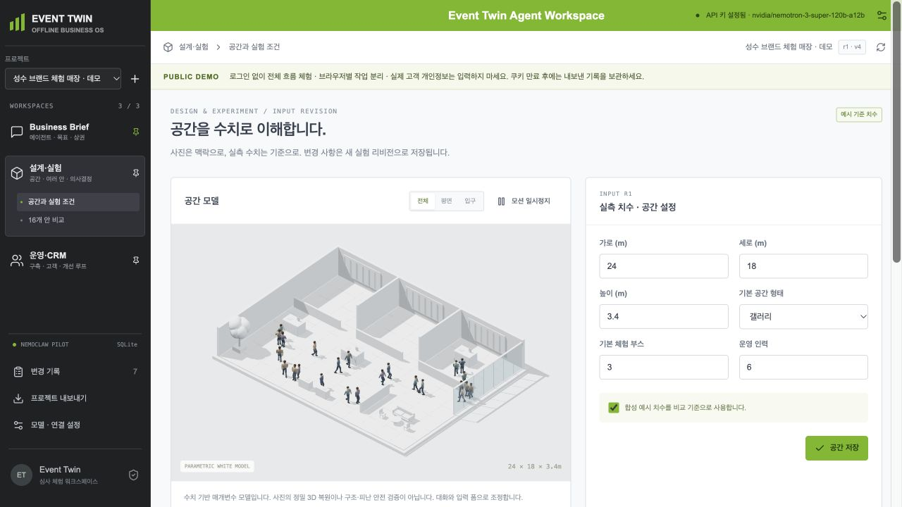
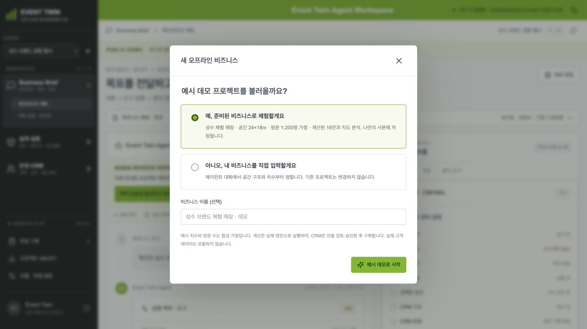
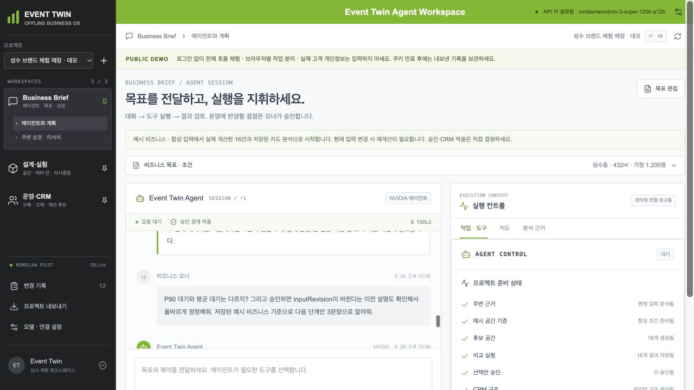
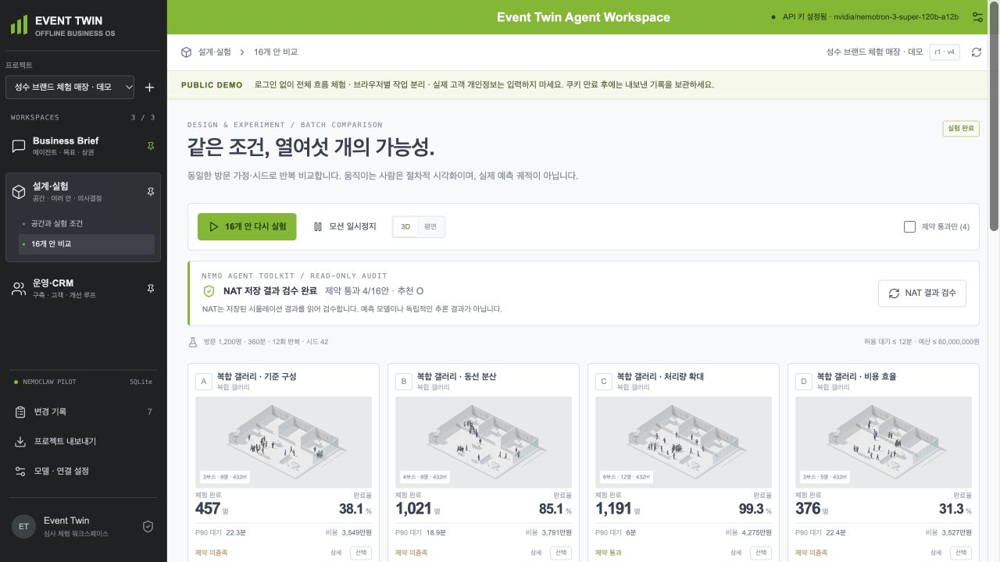
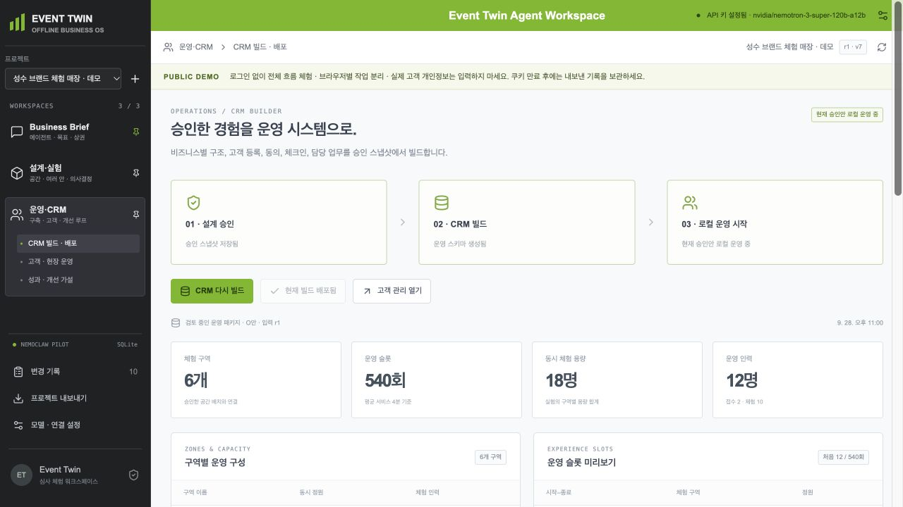
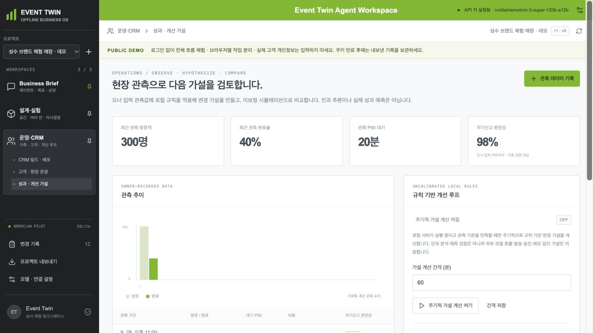
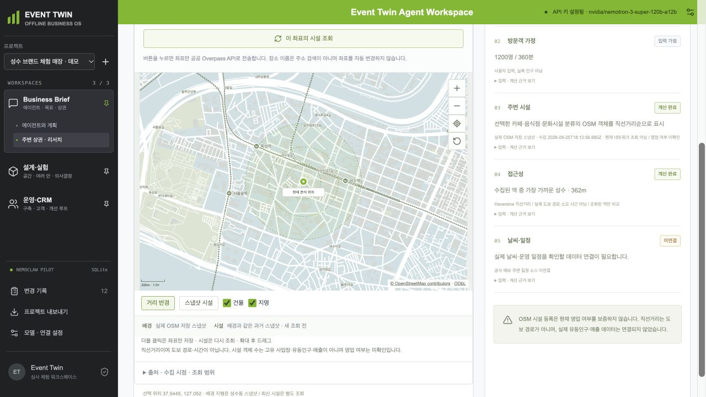
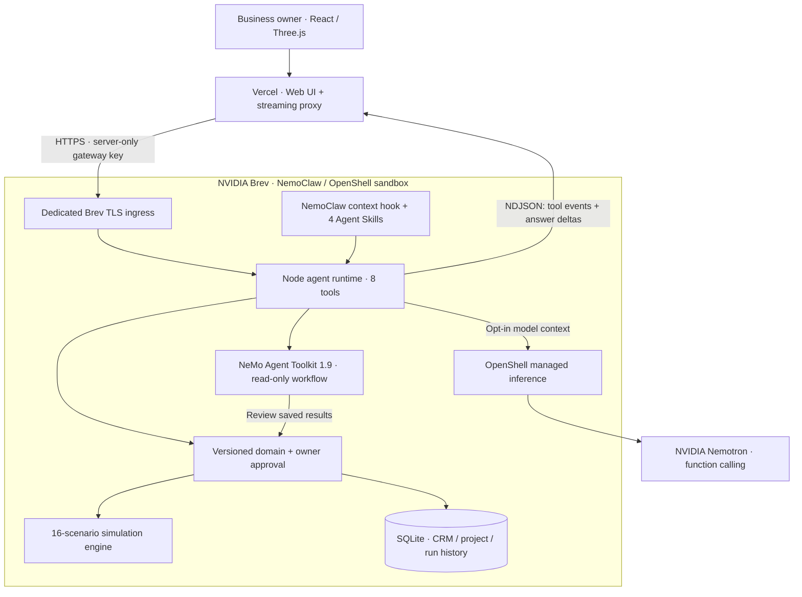

<div align="center">

# EVENT TWIN

### 오프라인 비즈니스의 다음 결정을, 실행 가능한 운영으로.

**Design the business. Test the possibilities. Operate with an agent.**

[](https://event-twin-nemoclaw.vercel.app)
[](#nvidia-powered-architecture)
[](https://github.com/yc9954/event-twin/actions/workflows/test.yml)

[라이브 데모](https://event-twin-nemoclaw.vercel.app) · [3분 체험](#3분-체험) · [아키텍처](docs/ARCHITECTURE.md) · [실행 방법](#로컬-실행)

</div>



> **공간을 이해하고, 여러 운영안을 실험하고, 선택한 안을 CRM으로 구축하고, 실제 운영에서 다시 배우는 오프라인 비즈니스 에이전트.**

매장, 브랜드 체험 공간, 전시, 오프라인 이벤트. 업종은 달라도 오너의 질문은 비슷합니다.
**“이 공간에서, 이 예산과 인력으로, 고객에게 어떤 경험을 제공해야 할까?”**
Event Twin은 그 질문을 대화 → 공간 → 실험 → 의사결정 → 운영 데이터로 연결합니다.

## 비전 — Offline Business Operating System

온라인 비즈니스는 출시 전 실험하고 운영 데이터를 반복해서 읽습니다. 오프라인에서는 공간·인력·고객 동선·대기·운영 시스템이 서로 분리되어 있어 같은 반복이 어렵습니다.

우리가 만드는 것은 3D 편집기나 보고서 생성 챗봇이 아닙니다. **비즈니스 오너의 목표를 실행 가능한 공간·운영안으로 바꾸고, 그 결정을 운영 시스템에 반영하는 에이전트 워크스페이스**입니다.

| 오너의 질문 | 에이전트가 연결하는 일 | 비즈니스 가치 |
| --- | --- | --- |
| 어디서, 어떤 공간으로 시작할까? | 지도 근거 + 수치 기반 공간 조건 정리 | 흩어진 기획 정보를 하나의 맥락으로 |
| 어떤 안이 더 나을까? | 16안 계산 + 예산·완료·대기 제약 비교 | 선택과 탈락 이유를 설명 가능한 결정으로 |
| 선택했으면 어떻게 운영하지? | 승인한 구역·정원·회차·업무를 CRM으로 빌드 | 설계 이후 반복 입력과 누락을 줄이는 흐름 |
| 현장에서는 왜 달라졌지? | 관측 → 개선 가설 → 재실험 → 재승인 | 한 번의 운영을 다음 결정의 근거로 |

**장기 비전:** 현장 데이터로 보정한 디지털 트윈, 실행 가능한 개입을 연구하는 에이전트, 여러 매장과 공간을 함께 최적화하는 운영 지능.
**현재 구현:** 한 비즈니스의 의사결정과 CRM 운영을 연결한 작동 가능한 수직 단면. 사업 효과는 운영안 확정→CRM 구축 시간, 입력 불일치, 제약 충족안 탐색률부터 검증합니다.

## 3분 체험

[공개 데모 열기 →](https://event-twin-nemoclaw.vercel.app)



1. **첫 프로젝트 만들기 → “예, 준비된 비즈니스로 체험할게요”**
   성수 브랜드 체험 매장의 합성 조건, 실제 계산한 16안, 저장된 지도 분석을 나만의 프로젝트로 불러옵니다. 실제 고객 데이터는 없습니다.
2. **“맥락 전송에 동의하고 에이전트 켜기”**
   “저장된 조건과 추천안, 다음에 할 일을 설명해줘”라고 질문합니다. Nemotron의 공개 답변과 도구 실행 기록이 스트리밍됩니다.
3. **16개 안 비교 → 상세 공간 → 통과안 승인**
   움직이는 방문객과 공간을 보고 완료율·대기·비용을 비교합니다. 상세 카메라는 방문객 따라가기로 시작합니다.
4. **CRM 빌드 → 로컬 CRM 배포 → 고객 등록·체크인**
   선택한 설계가 구역·슬롯·정원·업무와 실제 저장되는 고객 기록으로 연결됩니다.
5. **성과·개선 가설 → 관측 기록 → 가설 검토**
   운영 관측을 입력하고 변경 가정을 재계산합니다. 실제 운영 반영은 오너가 다시 승인합니다.

직접 시작하려면 **“아니오, 내 비즈니스를 직접 입력할게요”**를 선택하세요. 대화 안에서 공간 구조·가로·세로·높이·구역·인력을 선택하거나 채팅으로 초안을 입력한 뒤 확인합니다. 공간 미확인 상태에서 실행을 요청해도 같은 오류를 반복하지 않고 필요한 입력을 안내합니다.

로그인 없이 이용할 수 있고 브라우저별 프로젝트는 분리됩니다. 모델 호출 횟수에 자체 일일 제한은 두지 않았지만 NVIDIA 제공자 한도·잔액·서버 처리량은 적용됩니다. 실제 개인정보는 넣지 마세요. 세션은 8시간이며 필요한 기록은 내보내기로 보관하세요.

## Product Walkthrough

캡처는 페이지를 세로로 늘이거나 이어 붙이지 않은 **실제 브라우저 뷰포트**입니다. 아래 수치는 합성 데모 입력에 대한 실행 결과입니다.

### 01 · Agent — 대화가 실행의 시작점



공간 정보를 먼저 수집하고, 저장된 비즈니스 맥락을 읽어 필요한 도구를 선택합니다. 실행 상태, 도구 입력·결과, 공개 답변을 한 대화 안에 저장합니다. 오른쪽 패널에서 도구·지도·분석 근거를 전환합니다.

### 02 · Space — 말과 숫자로 만드는 공간


순백색 공간 모델, 구조 선택, 치수·구역·인력 입력, 방문객 모션과 카메라 추적. 복잡한 모델링 도구 대신 수치 입력과 에이전트의 공간 제안으로 조정합니다. 외부 편집기 iframe이 아니라 앱 내부 Three.js 렌더러를 사용합니다.

### 03 · Experiment — 한 가지 계획 대신 여러 가능성



4개 공간 템플릿 × 4개 운영 전략을 공통 방문객·기간·시드로 비교합니다. 16개 카드는 한 보드에서 스크롤하며 확인합니다. 추천 수치뿐 아니라 **예산·대기·완료·동의 목표 때문에 탈락한 이유**까지 의사결정에 포함합니다.

### 04 · Execute — 선택한 설계가 CRM으로



승인 스냅샷에서 구역·회차·정원·업무를 생성합니다. 고객 등록·CSV 가져오기·체크인·이용 상태·마케팅 동의와 철회가 SQLite에 저장됩니다. 기획을 수정해도 기존 운영 CRM과 고객 기록은 보존합니다.

### 05 · Learn — 현장 기록을 다음 결정으로



관측 기간·방문·완료·대기·동의·비용을 운영 버전에 연결합니다. 품질을 점검하고 변경 가정의 계산 결과를 비교한 뒤 승인 대기로 남깁니다. 현장 기록에서 다음 실험으로 이어지는 루프를 제품 안에 담았습니다.

### 06 · Context — 실제 지도를 의사결정 근거로



실제 OSM 도로·건물·시설 스냅샷과 위치별 거리 분석을 제공합니다. 출처와 수집 시점을 표시하고, 지도 근거와 방문 수·비용 같은 사용자 가정을 구분합니다.

## NVIDIA-powered Architecture

NVIDIA는 화면 테마가 아니라 **실행 환경, 추론, 에이전트 맥락, 워크플로우 검수**에 참여합니다.



| NVIDIA 구성 | 이 프로젝트에서 맡는 일 | 구현·검증 근거 |
| --- | --- | --- |
| **Brev** | 영속 Node 앱·SQLite·Python NAT를 실행하는 인스턴스 | [전용 서비스와 배포 구조](docs/DEPLOYMENT.md) |
| **NemoClaw / OpenShell** | 앱 실행 샌드박스와 관리형 추론 경로. 런타임 관측으로 웹 상태와 모델 지침 연결 | [런처](scripts/nemoclaw-launch.mjs), [런타임 관측](server/runtime-location.mjs) |
| **NemoClaw source reuse** | upstream `before_prompt_build` 맥락 훅을 웹 런타임에 맞게 수정 재사용 | [정확한 upstream 커밋·라이선스·재사용 범위](vendor/nemoclaw/UPSTREAM.md) |
| **Nemotron** | 자연어 요청 해석, 공개 답변, function calling으로 업무 도구 선택 | 배포 모델 `nvidia/nemotron-3-super-120b-a12b`, [실행 루프](server/agent.mjs) |
| **Managed inference** | `inference.local/v1`을 통한 서버 측 모델 호출. 제공자 키는 게이트웨이가 관리 | [모델 어댑터](server/model-provider.mjs) |
| **NeMo Agent Toolkit** | 실제 Python workflow로 저장된 16안의 스키마·제약·순위·입력 버전 검수 | [NAT 통합](integrations/nvidia/README.md), [브리지](server/nat-bridge.mjs) |
| **Agent Skills** | 목표 근거·공간 실험·CRM 실행·운영 재계획의 4개 도메인 가이드 | [스킬 레지스트리](server/skill-registry.mjs), [skills](skills/) |
| **NIM serving path** | 자체 GPU 서빙으로 전환 가능한 어댑터·Compose·준비 검사 | [NIM 준비](integrations/nvidia/README.md). 현재 공개 데모는 관리형 추론이며 자체 GPU 서빙은 준비 단계 |

### 왜 이렇게 나눴나요?

- **언어 판단은 Nemotron, 수치 계산은 재현 가능한 엔진:** 모델이 결과 수치를 만들어내는 대신 실제 도구 결과를 설명합니다.
- **실행 환경은 OpenShell, 업무 권한은 도메인 코드:** 샌드박스 격리와 오너 승인 규칙을 서로 대체하지 않고 함께 사용합니다.
- **상태 검수는 NAT:** 다른 실행 계층에서 저장된 결과를 읽어 대안·제약·추천 순위를 점검합니다. 메인 모델 루프는 Node가 담당합니다.
- **사용성은 웹, 상태는 영속 서버:** Vercel의 빠른 접근성과 Brev의 지속 실행·DB를 결합합니다.
- **설계와 운영을 버전으로 연결:** 입력이 바뀌면 이전 실험·승인은 무효화하고, 이미 배포된 CRM은 그대로 보존합니다.

**[상세 아키텍처 문서 →](docs/ARCHITECTURE.md)**
요청 생명주기, 스트리밍, 도구별 권한, 데이터 모델, NVIDIA 구성 간 계약, 실패 복구, 확장 로드맵까지 설명합니다.

## 로컬 실행

Node.js **22.13+의 22.x**와 npm이 필요합니다. NAT는 Python 3.11–3.13과 uv를 추가로 사용합니다.

```sh
git clone https://github.com/yc9954/event-twin.git
cd event-twin
npm ci
cp .env.example .env
npm run build
npm start
```

[http://127.0.0.1:4180](http://127.0.0.1:4180)에서 시작합니다. 키 없이도 명시적 로컬 도구 명령과 실제 시뮬레이션·CRM이 작동합니다. 자연어 NVIDIA 모델을 사용하려면:

```dotenv
MODEL_PROVIDER=nvidia
NVIDIA_BASE_URL=https://integrate.api.nvidia.com/v1
NVIDIA_MODEL=<tool-calling model ID>
NVIDIA_API_KEY=<local secret>
```

```sh
npm test
npm run build
npm audit --omit=dev
# 선택: 실제 NAT
node scripts/nvidia-nat.mjs setup
node scripts/nvidia-nat.mjs serve
# 선택: 모델 사용량이 발생하는 실제 합성 종단 검사
node --env-file-if-exists=.env scripts/nvidia-full-cycle.mjs
```

[배포 가이드](docs/DEPLOYMENT.md) · [검증 기록](docs/VERIFICATION.md) · [NAT / NIM 통합](integrations/nvidia/README.md)

## 구현 범위와 검증

비전과 현재 구현을 구분합니다. 실험 수치는 가정 기반 비교, 방문객 움직임은 절차적 시각화이며, 운영 개선은 현재 규칙 기반 가설입니다. 외부 Twenty 배포나 문자·이메일 발송은 하지 않습니다. 내부 Agent Skills를 NVIDIA Skill API 인증으로 표현하지 않습니다. 상세 조건과 실제 모델 실행 근거는 [검증 기록](docs/VERIFICATION.md)에 남깁니다.

## 프로젝트 구조

```text
client/                 React, agent chat, onboarding, map, Three.js
server/                 agent loop, tools, model adapters, domain, SQLite
shared/                 simulation, space generation, OSM data, policy
api/ + deploy/          Vercel streaming proxy, TLS, service configuration
integrations/nvidia/    NAT Python workflow, NIM deployment preparation
skills/                 four business-domain execution guides
tests/ + scripts/      regression, integration, real-provider verification
docs/                   architecture, deployment, verification, screenshots
vendor/nemoclaw/         attributed runtime-context adaptation
```

## 출처와 라이선스

- NemoClaw 수정 재사용: [upstream 기록](vendor/nemoclaw/UPSTREAM.md), [Apache-2.0](vendor/nemoclaw/LICENSE).
- 지도: [© OpenStreetMap contributors](https://www.openstreetmap.org/copyright), [ODbL 1.0](https://opendatacommons.org/licenses/odbl/1-0/).
- 제3자 패키지는 각 라이선스 및 [licenses/](licenses/)를 따릅니다. 프로젝트 전체의 별도 루트 라이선스는 아직 지정하지 않았습니다.
- Event Twin은 독립 프로젝트로 NVIDIA 공식 제품·인증 UI가 아닙니다. 모든 데모 고객·관측 데이터는 합성입니다.

<div align="center">

**PLAN → EXPERIMENT → APPROVE → OPERATE → LEARN**

한 번의 기획을 넘어, 계속 발전하는 오프라인 비즈니스로.

</div>
