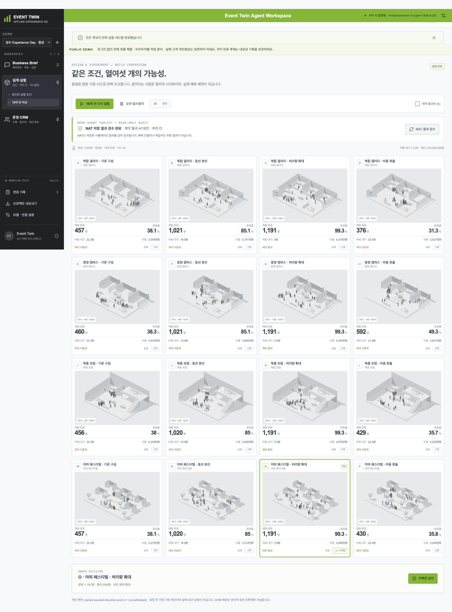
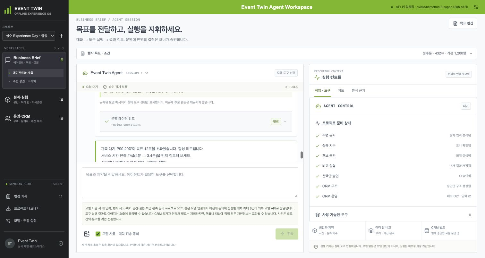
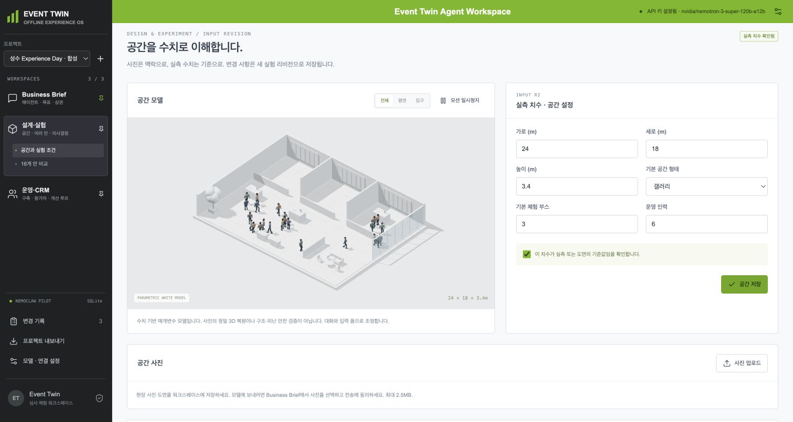
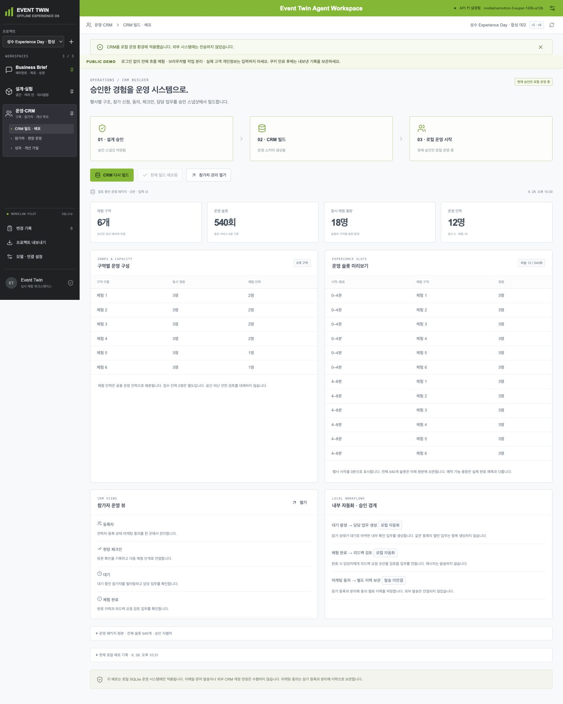
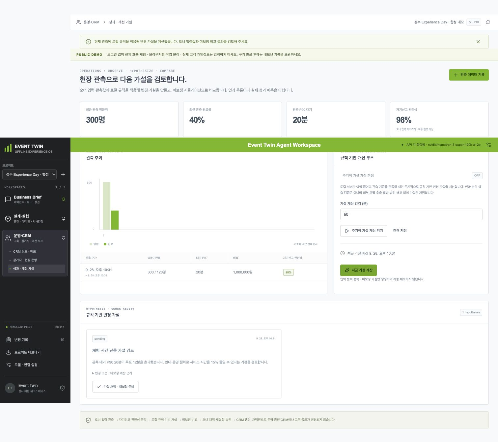
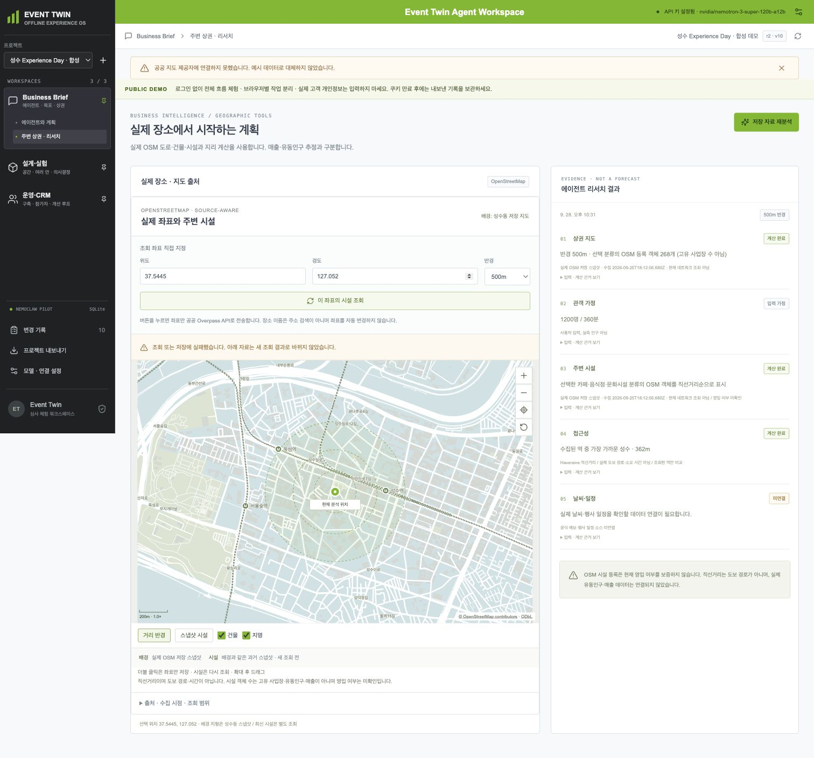
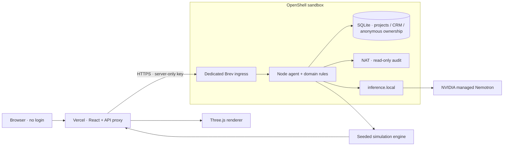

<div align="center">

# EVENT TWIN

### 행사를 열기 전에 실험하고, 선택한 안을 운영으로 연결합니다.

**An agent workspace for offline event decisions.**

[](https://event-twin-nemoclaw.vercel.app)
[](https://nodejs.org/)
[](#nvidia는-어디에서-쓰이나요)
[](https://github.com/yc9954/event-twin/actions/workflows/test.yml)

[데모 시작](https://event-twin-nemoclaw.vercel.app) · [3분 체험](#3분-체험-가이드) · [실행 방법](#로컬에서-실행하기) · [아키텍처](#아키텍처) · [검증과 한계](#검증과-한계)

</div>



> **“어떤 행사를 만들까?”에서 끝내지 않고, “어떤 안을 선택하고 어떻게 운영할까?”까지.**
> 목표·공간·예산·인력·관객 가정을 받아 운영안을 비교하고, 승인한 안으로 CRM을 구축하며, 현장 관측으로 다음 개선안을 검토하는 실행형 에이전트 파일럿입니다.

## 왜 Event Twin인가요?

오프라인 이벤트의 의사결정은 기획서, 도면, 인력표, 참가자 명단, 현장 보고서 사이에 흩어져 있습니다. 배치를 바꾸면 대기는 어떻게 달라지는지, 확정한 안이 정원과 업무에 일관되게 반영됐는지 확인하기 어렵습니다. Event Twin은 이 과정을 **하나의 버전이 있는 프로젝트**로 연결합니다.

| 기존의 단절 | Event Twin의 연결 |
| --- | --- |
| 목표는 문서에, 공간은 별도 도구에 | 대화와 수치 입력을 같은 맥락으로 관리 |
| 좋은 안을 직감으로 선택 | 공통 관객·시간·시드로 16안을 계산하고 제약 판정 |
| 기획 확정 후 CRM을 다시 수작업 구성 | 승인된 구역·정원·회차·업무를 CRM 객체로 생성 |
| 현장 결과가 다음 기획에 남지 않음 | 관측 → 개선 가설 → 재계산 → 사람의 승인 |

실제 사업 효과는 아직 측정하지 않았습니다. 우선 검증할 지표는 **운영안 확정→CRM 구축 시간**, **설계·운영 간 불일치**, **제약을 만족하는 안을 찾는 비율**입니다.

## 3분 체험 가이드

[공개 데모 열기 →](https://event-twin-nemoclaw.vercel.app)

로그인 없이 시작합니다. 프로젝트는 익명 브라우저 세션별로 분리됩니다. 데모 자체의 일일/방문자별 모델 호출 횟수 제한은 없으며, NVIDIA의 실제 한도·장애·잔액과 서버 처리량은 적용됩니다.

1. **새 프로젝트 만들기** — 예: `성수 익스피리언스 데이 · 데모`.
2. **Business Brief** — 목표를 정리합니다. `모델 사용 · 맥락 전송 동의`를 선택한 뒤 `프로젝트 상태 조회`로 실제 Nemotron 도구 실행을 확인합니다.
3. **설계·실험 → 공간과 실험 조건** — 치수·부스·인력을 확인하고 저장합니다. 데모에서는 예시 치수임을 이해하고 확인 체크를 합니다. 실제 행사에서는 실측값을 사용해야 합니다.
4. **16개 안 생성 → 비교 실행** — 완료율·대기·비용·제약 판정을 비교합니다. 3D 상세에서는 기본 `관객 따라가기`와 모션 재생을 볼 수 있습니다.
5. **통과안 승인 → CRM 구축 → 적용** — 구역·회차·정원·업무가 생성됩니다. 합성 참가자를 등록하고 체크인·완료 상태를 바꿔봅니다.
6. **현장 성과 → 관측 기록 → 개선 루프** — 예상과 다른 대기·완료율을 입력하고 제안을 확인합니다. 운영 반영은 사용자가 승인합니다.

**실제 고객 개인정보를 입력하지 마세요.** 세션 쿠키는 8시간 후 만료되고 계정 복구 기능은 없습니다. 필요한 합성 기록은 `프로젝트 내보내기`로 보관하세요. 로컬 도구 모드도 계산·CRM을 실제 실행하지만 LLM이 판단한 것으로 표시하지 않습니다.

## 화면으로 살펴보기

### 01 · Business Brief — 대화가 실행의 시작점



왼쪽은 대화, 오른쪽은 실행 상태·도구·근거입니다. 응답은 NDJSON 스트림으로 전달하고 Markdown으로 렌더링합니다. 도구 시작·완료·실패와 저장 완료를 구분하며, 새로고침 후 저장된 대화가 유지됩니다.

표시하는 것은 **공개 답변과 실행 영수증**입니다. 비공개 사고 과정을 재구성하거나 가짜 thinking을 표시하지 않습니다. 모델 전송은 명시적 동의가 필요하고 사진은 별도로 선택합니다.

### 02 · Space — 숫자로 이해하는 공간, 움직이는 관객



Three.js 기반 순백색 매개변수 공간 모델입니다. 치수·부스·인력·형태를 입력하거나 에이전트 도구로 초안을 조정합니다. 사용자가 3D 편집기를 직접 조작하거나 외부 편집기를 iframe으로 열 필요가 없습니다.

관객 모션, 입구·전체·평면 시점, 상세 뷰의 관객 추적을 제공합니다. 관객은 **절차적 경로 애니메이션**이며 각각 LLM으로 판단하는 실측 고객 페르소나는 아닙니다. 사진만으로 정밀한 3D를 자동 복원하는 기능도 아닙니다.

### 03 · Compare — 16안, 공통 가정, 명시적인 탈락 이유


4개 공간 템플릿 × 4개 운영 전략을 함께 비교합니다. 공통 방문자 수·기간·반복 시드로 완료·이탈·대기·이동·비용을 계산합니다. 추천안뿐 아니라 **왜 다른 안이 예산·대기·완료 목표를 통과하지 못했는지** 확인할 수 있습니다.

치수나 가정을 바꾸면 이전 계산·승인은 무효화됩니다. 현재 템플릿은 벽·구조도 달라질 수 있으므로 같은 실측 건물의 고정 벽을 유지한 운영안 비교와는 구분합니다.

### 04 · CRM — 승인된 설계가 실제 운영 데이터로



승인된 후보의 구역·슬롯·정원·담당 업무를 생성합니다. 참가자 등록·CSV 가져오기·체크인·상태·마케팅 동의와 철회·업무 결과를 SQLite에 저장합니다.

`적용`은 **앱 내부 운영 CRM에 반영**한다는 뜻입니다. 외부 Twenty 인스턴스에 배포하거나 문자·이메일을 발송하지 않습니다. 기획을 수정해도 이미 운영 중인 CRM과 참가자 기록은 보존합니다.

### 05 · Operations — 관측에서 다음 가설로



관측 기간·방문·완료·대기·동의·비용을 기록하고 품질과 배포 버전을 검증합니다. 개선 루프는 변경 가설을 재계산하고 사용자 승인 대기 상태로 남깁니다. 현재는 **규칙 기반 미보정 가설**이며 인과 추론이나 자율 연구 성능이 검증된 시스템으로 주장하지 않습니다.

### 06 · Map — 실제 지도와 출처가 있는 리서치



성수동의 실제 OpenStreetMap 도로·건물 스냅샷과 시설 정보를 사용합니다. 좌표·반경 기반 새 시설 조회는 별도 기능입니다. 수집 시점·OSM 링크·직선거리·출처를 표시하며 실패한 조회를 만들어낸 수치로 대체하지 않습니다.

시설 수는 유동인구·매출·영업 여부가 아닙니다. 배경 지도 범위 밖은 다른 지역인 것처럼 그리지 않습니다. 외부 조회는 공급자와 실행 환경의 네트워크 정책에 영향을 받습니다.

> 현재 공개 샌드박스에서 Overpass의 새 시설 조회는 연결 실패가 관측되었습니다. 저장된 **실제 OSM 스냅샷**의 지도·거리 분석은 작동하지만 최신 조회 성공으로 표시하지 않습니다. 강의 인스턴스의 네트워크 정책은 변경하지 않았습니다.

## NVIDIA는 어디에서 쓰이나요?

| 구성 요소 | 실제 역할 | 구분해야 할 점 |
| --- | --- | --- |
| **NVIDIA Brev** | 앱·DB·NAT가 동작하는 기존 CPU VM | GPU를 새로 구매한 구성 아님 |
| **NemoClaw / OpenShell** | 기존 샌드박스에 앱·NAT 실행, 관리형 추론 연결 | runtime-context 훅은 출처와 라이선스를 보존해 수정 재사용 |
| **Nemotron** | 자연어 응답과 실제 function calling | 배포 모델: `nvidia/nemotron-3-super-120b-a12b` |
| **Managed inference** | `https://inference.local/v1`을 통한 제공자 호출 | 키는 OpenShell에서 관리하며 브라우저/GitHub에 포함하지 않음 |
| **NeMo Agent Toolkit 1.9.0** | 실제 Python workflow의 상태 조회·16안 결과 읽기 전용 감사 | 메인 모델 에이전트 전체를 NAT가 오케스트레이션하는 구조 아님 |
| **Agent skills** | 목표 근거, 공간 실험, CRM 실행, 운영 재계획 가이드 | 내부 `SKILL.md`; build.nvidia.com Skill API 연동과 다름 |
| **NIM** | 자체 서빙 어댑터·GPU 준비 검사·Compose 제공 | 공개 데모에서 GPU에 NIM 가중치를 자체 서빙한 것은 아님 |

NVIDIA UI에서 참고한 색·밀도·정보 구조를 사용하지만 **NVIDIA 공식 제품이나 인증 UI는 아닙니다.** 실제 기술 연동과 대회별 필수 인정 조건은 별도로 확인해야 합니다.

## 아키텍처



### 실행 권한은 모델의 문장이 아니라 코드로 검증합니다

| 도구 | 기능 |
| --- | --- |
| `get_project` | 프로젝트·입력·실험·운영 맥락 읽기 |
| `analyze_area` | 저장된 지리 근거와 운영 가정 분석 |
| `propose_space` | 수치 기반 공간 초안 조정 |
| `update_assumptions` | 실험 가정 변경 |
| `generate_candidates` | 16개 후보 생성 |
| `run_simulation` | 반복 시뮬레이션과 제약 판정 |
| `build_crm` | 승인된 후보에서 CRM 초안 생성 |
| `review_operations` | 관측·업무·개선 제안 검토 |

`안 승인`, `CRM 적용`, `개선안 채택`은 사용자 전용입니다. 임의 shell·임의 네트워크 도구는 없습니다. 동시 수정은 `expectedVersion`으로 차단하고 실패한 모델 요청은 미완료 변경을 롤백합니다. 일시적 제공자 5xx는 모델 요청만 제한적으로 재시도하며 완료한 도구·저장은 재실행하지 않습니다.

## 로컬에서 실행하기

**Node.js 22.13+의 22.x**, npm이 필요합니다. NAT는 Python 3.11–3.13과 uv가 추가로 필요합니다.

```sh
git clone https://github.com/yc9954/event-twin.git
cd event-twin
npm ci
cp .env.example .env
npm run build
npm start
```

[로컬 앱 열기 — http://127.0.0.1:4180](http://127.0.0.1:4180)에 접속합니다. 키 없이도 로컬 도구 모드로 실제 시뮬레이션·CRM을 실행할 수 있습니다. NVIDIA hosted 모델은 `.env`에 직접 설정합니다.

```dotenv
MODEL_PROVIDER=nvidia
NVIDIA_BASE_URL=https://integrate.api.nvidia.com/v1
NVIDIA_MODEL=<사용 가능한 tool-calling 모델 ID>
NVIDIA_API_KEY=<로컬 비밀키>
```

키는 커밋하지 않습니다. 모델 제공자 간 자동 fallback은 없습니다. 공개 데모와 로컬 DB는 별개입니다.

```sh
npm test
npm run build
npm audit --omit=dev

# 선택: 실제 NAT 서버
node scripts/nvidia-nat.mjs setup
node scripts/nvidia-nat.mjs serve

# 선택: 실제 NVIDIA API를 호출하는 합성 종단 검사
node --env-file-if-exists=.env scripts/nvidia-full-cycle.mjs
```

[배포·환경변수·보안](docs/DEPLOYMENT.md) · [NAT 계약과 NIM 준비](integrations/nvidia/README.md)

## 검증과 한계

- 자동 회귀는 도메인·HTTP·SQLite 영속성·동의·스트림·공간 경로·시뮬레이션·세션 격리·프록시를 다룹니다. 최신 결과는 [검증 기록](docs/VERIFICATION.md)과 GitHub Actions에서 확인합니다.
- 실제 모델 검사와 fixture 테스트를 분리합니다. fixture 통과를 NVIDIA 실추론 성공으로 표시하지 않습니다.
- 종단 검사는 **실제 모델 읽기 도구 + 로컬 계산/CRM 도구**의 하이브리드입니다. 모델이 전 과정을 독립적으로 판단했다는 주장이 아닙니다.
- 시뮬레이션은 가정 아래 대안 비교이며 실측 보정된 미래 매출·성과 예측이 아닙니다.
- 3D 관객은 설명용 절차적 표본입니다. 물리 기반 군중·피난 안전 인증, 사진 정밀 복원, 개별 소비자 행동 모델은 범위 밖입니다.
- 외부 CRM·결제·문자·이메일 발송, 계정 복구·관리자 권한·SLA는 구현 범위 밖입니다.

## 프로젝트 구성

```text
client/                  React UI, Markdown, 지도, Three.js
server/                  HTTP, 에이전트, 모델 어댑터, 도메인, SQLite
shared/                  실험 엔진, 공간 생성, 도구 정책, OSM 데이터
api/                     Vercel 스트리밍 프록시
deploy/                  세션 서명, Brev nginx/systemd 예시
integrations/nvidia/     NAT Python workflow, NIM 준비 파일
skills/                  4개 업무별 에이전트 실행 가이드
scripts/                 실행·배포 준비·실연동 QA
tests/                   Node 회귀 테스트
docs/                    체험 화면, 배포·검증 기록
vendor/nemoclaw/         수정 재사용 코드와 upstream 라이선스
```

## 출처와 라이선스

- NemoClaw 수정 재사용 범위는 [UPSTREAM.md](vendor/nemoclaw/UPSTREAM.md), [Apache-2.0 원문](vendor/nemoclaw/LICENSE)에 기록했습니다.
- 지도: [© OpenStreetMap contributors](https://www.openstreetmap.org/copyright), [ODbL 1.0](https://opendatacommons.org/licenses/odbl/1-0/). 스냅샷 메타데이터와 UI 출처 표기를 유지합니다.
- React·Three.js 등 제3자 의존성은 각 패키지 및 [licenses/](licenses/)를 따릅니다. 프로젝트 전체의 별도 루트 라이선스는 아직 지정하지 않았습니다.
- 스크린샷은 실제 실행 화면입니다. 행사·참가자·관측 수치는 **합성 데모 데이터**이며 실제 고객 실적이 아닙니다.

<div align="center">

**PLAN → EXPERIMENT → APPROVE → OPERATE → LEARN**

오프라인 경험을 더 잘 결정하기 위한, 하나의 연결된 작업 공간.

</div>
