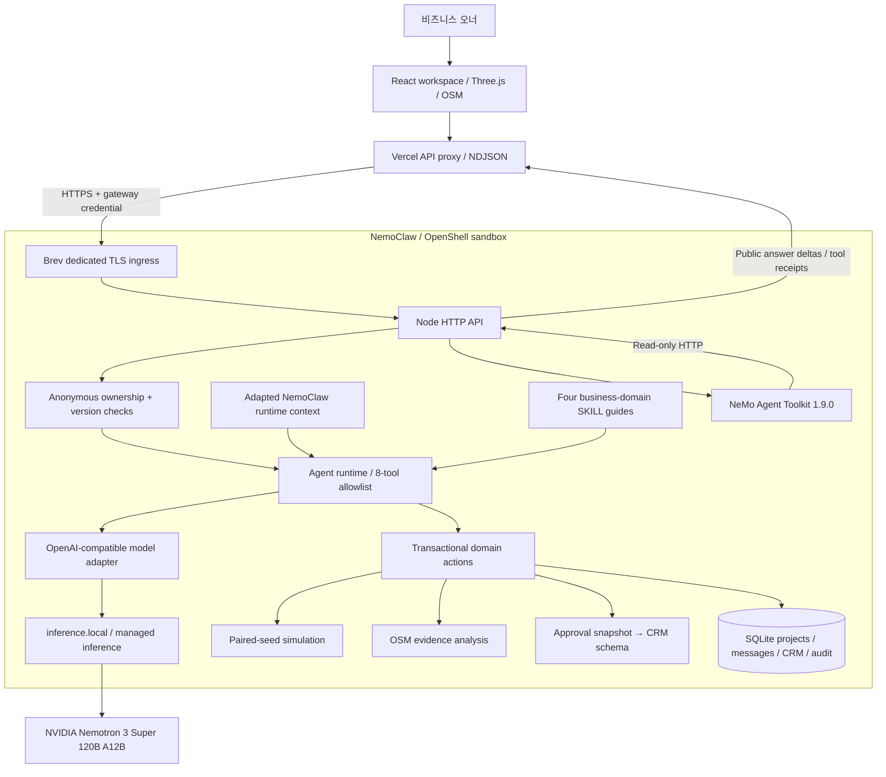
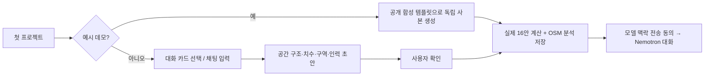

# Event Twin · NVIDIA 기반 오프라인 비즈니스 에이전트 아키텍처

## 1. 제품이 지향하는 변화

목표는 오프라인 비즈니스의 **계획 → 실험 → 실행 → 학습**을 하나의 상태 모델로 연결하는 것이다. 매장·체험 공간·전시·이벤트를 기획하는 오너가 자연어로 목표를 제시하면, 에이전트가 공간·운영 제약을 확인하고 대안을 계산한다. 오너가 선택하면 그 설계에서 CRM 구조가 만들어진다. 현장 기록은 다음 실험의 입력으로 돌아온다.

현재 데모는 이 반복의 수직 단면을 구현한다. 장기적으로는 실제 운영 데이터로 보정된 공간·고객 모델과 개입 연구를 결합하는 **Offline Business Operating System**으로 확장한다. 미래 기능과 현재 실행 경로를 혼동하지 않는 것이 설계 원칙이다.

## 2. 배포 토폴로지

Vercel은 웹과 요청 프록시를 담당한다. Node·NAT·SQLite는 Brev의 영속 샌드박스에 남는다. Vercel 함수의 임시 파일 시스템에 운영 DB를 넣지 않는다. 전용 TLS ingress는 앱 API만 전달하며 강의 사이트나 터미널은 공개하지 않는다.

## 3. NVIDIA 구성의 역할

### 3.1 Brev — 지속 실행과 운영 상태

Brev 인스턴스가 앱 서버, NAT Python 프로세스, SQLite 저장소를 실행한다. 현재 인스턴스는 관리형 모델 API를 이용하는 CPU 실행 환경이다. 브라우저 3D 렌더링과 서버의 대기열 계산 때문에 고가 GPU를 별도로 임대한 구조는 아니다.

전용 systemd 서비스가 OpenShell의 기존 샌드박스 안에서 [nemoclaw-launch.mjs](../scripts/nemoclaw-launch.mjs)를 실행한다. 런처는 Node 앱과 NAT를 함께 기동하며 한 프로세스가 실패하면 자식을 정리한다. 배포 시 앱 서비스만 재시작하고 기존 강의 게이트웨이·모델 키·정책을 재설정하지 않는다.

### 3.2 NemoClaw / OpenShell — 실행 경계와 모델 맥락

두 가지를 구분해 사용한다.

1. **실제 실행 환경:** 공개 데모의 앱 프로세스는 OpenShell 샌드박스 내부에서 실행한다. [runtime-location.mjs](../server/runtime-location.mjs)가 시작 시 관측한 환경으로 연결 상태를 표시한다. 환경변수 하나나 저장소 clone만으로 연결됐다고 표시하지 않는다.
2. **소스 재사용:** NemoClaw upstream의 런타임 요약과 `before_prompt_build` 훅을 JavaScript로 수정 재사용했다. [runtime-context.mjs](../vendor/nemoclaw/runtime-context.mjs)가 모델에 실제 실행 환경·도구 범위·승인 경계를 전달한다. 정확한 커밋과 Apache-2.0 출처는 [UPSTREAM.md](../vendor/nemoclaw/UPSTREAM.md)에 남겼다.

이 훅 자체가 보안 경계인 것은 아니다. 실제 권한은 서버 도구 allowlist, 도메인 검증, 소유권 검사, OpenShell 실행 정책이 각각 담당한다. 전체 OpenClaw 웹 UI를 iframe으로 삽입하거나 upstream lifecycle을 통째로 복제한 제품도 아니다.

### 3.3 Nemotron — 자연어 이해와 실제 도구 호출

공개 배포의 모델 ID는 `nvidia/nemotron-3-super-120b-a12b`다. 브라우저가 모델에 직접 접근하지 않고 서버 어댑터가 관리형 추론 엔드포인트를 호출한다.

Nemotron이 맡는 것은 목표 해석, 필요한 도구 선택, 결과에 근거한 설명이다. 좌표 거리, 대기·비용, CRM 구역과 슬롯은 각각 실제 코드가 계산하거나 생성한다. 모델이 그럴듯한 완료 인원이나 CRM 생성 사실을 발명하는 것으로 실행을 대체하지 않는다.

### 3.4 Managed inference / NIM — 추론 배치 분리

현재 공개 경로는 `https://inference.local/v1`이다. 제공자 키는 OpenShell 게이트웨이가 관리하고 앱의 SDK 식별용 inert key는 실제 NVIDIA 비밀키가 아니다. 주입된 CA를 유지하며 TLS 검증을 끄지 않는다.

[model-provider.mjs](../server/model-provider.mjs)는 NVIDIA hosted API와 자체 NIM endpoint를 구분해 지원한다. [NIM Compose와 preflight](../integrations/nvidia/README.md)는 GPU 호스트에서 자체 서빙을 준비하는 경로다. 현재 데모에서 자체 GPU에 NIM 가중치를 올려 서빙한 것으로 주장하지 않는다. 운영 규모·모델 프로필·비용에 맞춰 추론 인프라를 교체할 수 있도록 경계를 분리한 것이다.

### 3.5 NeMo Agent Toolkit — 독립적인 워크플로우 검수

실제 `nvidia-nat==1.9.0` Python 패키지와 등록 함수를 사용한다. 저장된 프로젝트를 읽고 16개 실험 결과의 개수·후보 ID·수치 범위·입력 리비전·제약·추천 순위를 검사한다. NAT 결과는 Node가 다시 계약 검증한 후 UI에 보여준다.

- 입력: 프로젝트 ID와 허용된 읽기 요청.
- 출력: 프레임워크 버전, 도구 이름, 읽기 전용 여부, 감사 상태와 비식별 요약.
- 상태: 준비 전, 오래된 입력, 잘못된 결과, 유효한 결과를 구분한다.
- 권한: 승인·CRM 적용·모델 호출을 수행하지 않는다.

메인 Nemotron 대화 루프는 Node에 있고 NAT는 읽기 전용 검수 계층이다. NAT가 전체 에이전트를 오케스트레이션하거나 미래 성과를 검증했다는 의미는 아니다. [브리지 계약](../integrations/nvidia/README.md)에 입력·출력·네트워크 경계를 명시했다.

### 3.6 Agent Skills — 업무 목적을 잃지 않는 실행 지침

| 가이드 | 판단의 초점 |
| --- | --- |
| [Brief evidence](../skills/event-brief-evidence/SKILL.md) | 목표·위치·자료·가정을 구분하고 비어 있는 맥락 수집 |
| [Space experiments](../skills/event-space-experiments/SKILL.md) | 공간 수치 확인, 동일 실험 조건, 여러 제약을 함께 검토 |
| [CRM execution](../skills/event-crm-execution/SKILL.md) | 승인된 버전에서 구조 생성, 동의 분리, 기존 운영 보존 |
| [Operations replan](../skills/event-operations-replanning/SKILL.md) | 현장 관측 품질 확인, 개입 가설 비교, 오너 재승인 |

스킬은 서버가 로드하는 내부 도메인 지침이며 임의 shell 권한을 추가하지 않는다. `build.nvidia.com`의 별도 Skill API 호출·인증과는 다른 개념이다.

## 4. 첫 프로젝트와 공간 이해

예시는 기존 오너 DB를 복사하지 않는다. 공개된 합성 조건으로 새로운 ID를 만들고 같은 도메인·실험 엔진을 실행한다. 승인과 CRM 적용은 자동 처리하지 않는다. 직접 입력 경로에서는 모델이 공간 초안을 제안해도 `confirmed=false`를 유지하고 사용자가 카드에서 확인한다.

모델 사용 전에는 로컬 명령만 실행한다. 새 UI는 이 상태를 명확히 표시하고 명시적인 NVIDIA 대화 시작 버튼을 제공한다. 공간 미확인 상태의 후보 생성·재시도는 입력 안내로 연결된다.

## 5. 한 번의 대화가 실행되는 과정

1. 브라우저가 메시지, 프로젝트 버전, 모델 사용 동의, 동의한 연결 ID, 선택된 사진 ID를 보낸다.
2. Vercel이 익명 세션을 검증하고 서버 간 인증으로 Brev API에 전달한다. 개인 제공자 키를 브라우저에 전달하지 않는다.
3. 서버가 프로젝트 소유권과 `expectedVersion`을 확인한다. 이미 다른 창에서 변경됐다면 재조회하도록 한다.
4. 모델 모드에서는 동의한 제공자 연결을 확인하고 CRM 연락처를 제외한 맥락과 같은 연결에서 동의한 최근 대화 최대 8건을 구성한다.
5. NemoClaw 맥락 훅·Agent Skills·서버 가이드가 실제 사용 가능한 도구와 승인 경계를 설명한다.
6. Nemotron이 허용된 도구를 선택하면 Node가 인수를 검증하고 도메인 코드가 프로젝트 초안에 적용한다.
7. 도구 결과가 다음 모델 요청으로 돌아간다. 브라우저에는 NDJSON으로 도구 시작·완료·실패와 공개 답변 델타를 전달한다.
8. 요청이 완료되면 변경된 프로젝트·메시지·실행 기록을 함께 저장한다. 중간 공개 출력과 저장 완료 상태를 구분한다.

표시하는 실행 맥락은 실제 도구 기록과 모델의 공개 출력이다. 비공개 내부 chain-of-thought를 재현하거나 발명하지 않는다.

## 6. 도구와 오너 권한

| 도구 | 역할 | 변경 |
| --- | --- | --- |
| `get_project` | 비즈니스 조건·결과·승인·운영 맥락 조회 | 없음 |
| `analyze_area` | 저장된 OSM 근거와 사용자 가정 분석 | 연구 결과 저장 |
| `propose_space` | 수치 기반 공간 초안 제안 | 입력 변경·치수 재확인 필요 |
| `update_assumptions` | 실험 가정 변경 | 이전 비교·승인 무효화 |
| `generate_candidates` | 확인된 조건에서 16안 생성 | 후보 저장 |
| `run_simulation` | 공통 시드 반복 계산 | 결과·추천 저장 |
| `build_crm` | 승인된 안에서 구역·슬롯·업무 생성 | CRM 초안 저장 |
| `review_operations` | 비식별 관측·업무·개선 제안 조회 | 없음 |

**사용자만 할 수 있는 일:** 기준 치수 확인, 안 승인, CRM 적용, 개선 제안 채택. 에이전트 도구에는 임의 shell·외부 발송·결제·승인 우회 기능이 없다.

## 7. 상태와 일관성

- **Project:** 비즈니스 목표, 위치, 공간, 실험 가정, 입력 리비전.
- **Experiment:** 16개 후보, 반복 계산, 제약 판정, 추천 ID와 계산 시점.
- **Approval:** 선택 후보와 입력 리비전에 묶인 승인 스냅샷.
- **CRM:** 생성 스키마와 운영 배포를 분리. 구역·슬롯·고객·등록·동의·업무·활동 기록.
- **Operations:** 운영 버전과 관측 기간에 묶인 기록, 품질과 변경 가설.
- **Conversation:** 사용자 요청, 모델/로컬 모드, 도구 기록과 저장된 공개 답변.

입력 변경은 실험·승인·미배포 스키마를 무효화하지만 기존 운영 배포를 삭제하지 않는다. 동의는 고객 등록과 독립된 기록으로 유지한다. 모델에는 연락처를 제공하지 않는다.

## 8. 실패·운영·검증

모델 오류는 작업 초안의 미완료 변경을 롤백한다. 일시적 제공자 5xx 재시도는 모델 요청에 제한되며 완료된 도구 작업을 임의로 반복하지 않는다. 스트림이 끊겼다면 서버의 최신 상태를 읽고 판단한다. 로컬 규칙을 몰래 LLM 대체 응답으로 표시하지 않는다.

공개 데모는 브라우저별 signed HttpOnly 세션으로 격리한다. 모델 동시 요청은 3개, FIFO 대기는 최대 20초이며 일일 사용량 상한은 아니다. 자원·키·과금 정보는 공개 저장소에서 제외한다.

회귀 테스트는 도메인, HTTP, 실제 SQLite 재시작, 스트림, 소유권, 도구 경계, 이미지 동의, 모델 어댑터, 3D 경로, 온보딩을 검증한다. 실제 NVIDIA 성공 실행은 fixture와 별도로 [검증 기록](VERIFICATION.md)에 남긴다.

## 9. 다음 확장 단계

| 단계 | 확장 목표 | 확인해야 할 근거 |
| --- | --- | --- |
| 실측 보정 | 현장 대기·서비스·이동 데이터로 파라미터 보정 | 보류 데이터에서 오차와 범위 측정 |
| 고정 공간 트윈 | 같은 실측 벽·출입구를 유지하며 운영 개입 비교 | 공간 제약·경로의 일관성 |
| 실행 가능한 개입 연구 | 사전 등록, 접수 분리, 인력 재배치 후보 연구 | 비용·부작용·운영 가능성 |
| 외부 운영 연결 | CRM·메시징·POS와 승인 기반 동기화 | 동의·멱등성·실패 복구 |
| 다점포 학습 | 공간별 관측에서 재사용 가능한 운영 정책 도출 | 지점 간 데이터 권한·일반화 |

현재 계산은 가정 기반 대안 비교, 3D 모션은 절차적 시각화, 개선안은 규칙 기반 가설이다. 이 구분을 유지하면서 실제 데이터로 검증 범위를 넓히는 것이 비전과 구현을 연결하는 로드맵이다.
